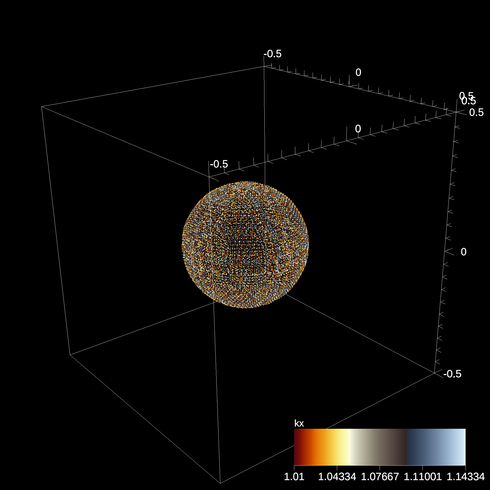

# Ascent

<details><summary>Alps/Daint</summary><p>

<details><summary>Setup</summary>

```bash
# git clone https://github.com/sphexa-org/sphexa sphexa.git
# uenv image pull ascent/0.9.5:v1
uenv start -v default ascent/0.9.5:v1
```

⚠️ Ascent will generate images based on the ascent actions (and `cycle`) defined in ascent_adaptor.h, check that file before building:

```bash
grep -m1 trigger_file sphexa.git/main/src/ascent_adaptor.h  
  std::string trigger_file = conduit::utils::join_file_path("./","sphexa_Ascent_actions.yaml");

grep -m1 cycle sphexa.git/main/src/ascent_adaptor.h
  std::string condition = "cycle() % 200 == 0";
```

```bash
grep addField sphexa.git/main/src/ascent_adaptor.h |grep -v // |cat -n
     1	void addField(conduit::Node& mesh, const std::string& name, FieldType* field, size_t start, size_t end)
     2	    addField(mesh, "x", get<"x">(d).data(), startIndex, endIndex);
     3	    addField(mesh, "y", get<"y">(d).data(), startIndex, endIndex);
     4	    addField(mesh, "z", get<"z">(d).data(), startIndex, endIndex);
     5	    addField(mesh, "vx", get<"vx">(d).data(), startIndex, endIndex);
     6	    addField(mesh, "vy", get<"vy">(d).data(), startIndex, endIndex);
     7	    addField(mesh, "vz", get<"vz">(d).data(), startIndex, endIndex);
     8	    addField(mesh, "kx", get<"kx">(d).data(), startIndex, endIndex);
     9	    addField(mesh, "xm", get<"xm">(d).data(), startIndex, endIndex);
    10	    addField(mesh, "alpha", get<"alpha">(d).data(), startIndex, endIndex);
    11	    addField(mesh, "m", get<"m">(d).data(), startIndex, endIndex);
```    

</details>

<details><summary>Build with Ascent in a uenv (cmake)</summary>

```bash
CC=mpicc CXX=mpicxx \
cmake \
-S sphexa.git \
-B build \
-DINSITU="Ascent" \
-DAscent_DIR=$(find /user-tools/ -name ascent | grep ascent- | grep cmake) \
-DCMAKE_BUILD_TYPE="Debug" \
-DCMAKE_CUDA_ARCHITECTURES="90" \
-DCSTONE_WITH_GPU_AWARE_MPI="ON" \
-DBUILD_TESTING="OFF" -DBUILD_ANALYTICAL="OFF" -DSPH_EXA_WITH_HIP="OFF" -DSPH_EXA_WITH_GRACKLE="OFF" -DSPH_EXA_WITH_DISKS="OFF"
```

and then

```bash
cmake --build build -t sphexa-cuda -j
```

</details>

<details><summary>Build with Ascent in a uenv (spack) WIP</summary>

```bash
uenv start -v default ascent/0.9.5:rc2
source spack.git/share/spack/setup-env.sh
spack env create -d .
spack -e . config add 'include:[/user-tools/config]'
spack find -lvp ascent

spack -e . spec sphexa ^ascent+occa+fortran+python # OK
spack -e . install --add sphexa ^ascent+occa+fortran+python # OK
```

</details>

<details><summary>Test</summary>

```bash
rm -fr datasets
cp ./sphexa.git/scripts/ascent/sphexa_Ascent_actions.yaml .

OMP_NUM_THREADS=64 srun \
-N1 -n4 --ntasks-per-node=4 -t5 -A $(id -gn) \
./sphexa.git/ci/scripts/cuda-vars.sh \
./build/main/src/sphexa/sphexa-cuda --init sedov -s 200 -n 100 --quiet
```

- A succesfull job will generate an image inside `datasets/`



</details>

<details><summary>Troubleshooting</summary>

⚠️ Ascent outputs will be empty when the number of particles per gpu is too small:

```bash
AscentInitialize
...
s1/p1 pseudocolor plot yielded no data, i.e., no cells remains
s1/p2 pseudocolor plot yielded no data, i.e., no cells remains
```

⚠️ Expressions support requires occa:
```bash
/user-tools/linux-neoverse_v2/occa-2.0.0-v5z3xa4m7eqt6w4g25qldl26dltxrlyp/bin/occa env |grep ": 1"
    - OCCA_OPENMP_ENABLED        : 1
    - OCCA_CUDA_ENABLED          : 1
```

</details>

</p>
</details>
